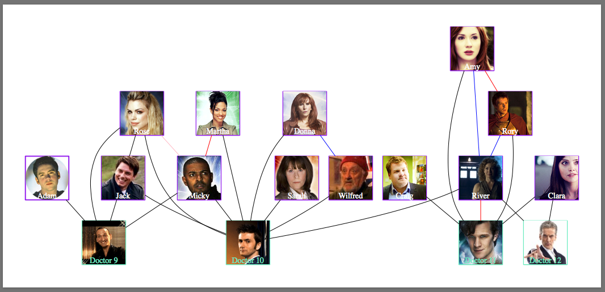

Using Graphviz to create Doctor Who & Companion Relationship
------------------------------------------------------------

**Description**

Using [Graphviz](http://www.graphviz.org/) to display nodes that connect the relationship between chacacters in [Doctor Who](http://www.bbc.co.uk/programmes/b006q2x0).

**How it works**

Started by creating different types of node shapes for the doctor and the companions. Then connecting each node to the appropriate doctor and companion. 

Step-by-step guide to creating horizontal relationships provided by [DevelopHerDevelopHim](https://www.youtube.com/channel/UCmAIHsNUyAzJ6FQMdU5jdRw) on their episode [Graphviz - Doctor Who](https://youtu.be/JXfobuvyFOA)

### Screenshot

**Horizontal Relationships**

**Vertical Relationships**

**With Images and Colors**

### About the Developers    

James Cha    
[Linkedin](https://www.linkedin.com/in/jamesjcha)         

Jessica Dene Earley    
[Short Bio](https://chatasweetie.com/about-me/)   
[Linkedin](https://www.linkedin.com/in/jessicaearley)      
[Jessica's Blog](https://chatasweetie.com/)  